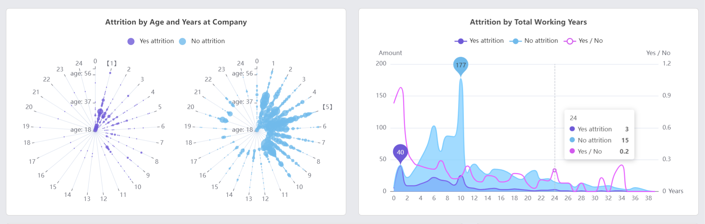

<div id="top"></div>

<!-- PROJECT LOGO -->
<br />
<div align="center">
  <h3 align="center">HR Analytics Employee Attrition</h3>
  <p align="center">
    📊 📈  Data visualization using vue-echarts
    <br />
    <br />
    <a href="https://oleinikovapolina.github.io/visualization/dist/">View Demo →</a>
  </p>
</div>


<!-- TABLE OF CONTENTS -->
<details>
  <summary>Table of Contents</summary>
  <ol>
    <li><a href="#about">About the project</a></li>
    <li><a href="#summary">Summary</a></li>
    <li><a href="#built-with">Built With</a></li>
    <li><a href="#project-setup">Project setup</a></li>
  </ol>
</details>

<br/>


<!-- ABOUT -->
<h2 id="about">✨ About The Project</h2>



HR analytics is the process of collecting and analyzing data on human resources (HR) in order to improve the efficiency of the organization's personnel. This data analysis method uses data that is regularly collected by the HR department and correlates it with the goals of the HR department and the organization. This provides balanced evidence of how HR initiatives contribute to the achievement of the goals and strategies of the organization.

The need for HR analytics Most organizations already have data that is collected regularly, so why the need for a specialized form of analytics? After systematization, comparison and analysis, these raw data provide useful information. They can help answer questions like:
* What patterns can be revealed in employee turnover?
* How long does it take to hire employees?
* Which of our employees is most likely to quit within a year?
* Do training and development initiatives affect employee productivity?

<p align="right">(<a href="#top">back to top</a>)</p>


<!-- SUMMARY -->
<h2 id="summary">🌟 SUMMARY</h2>

* Attrition by Monthly Income and Departments (boxplot, line)\
  We see a difference in salaries of employees with different attrition status in all departments. However, the difference varies. It is the least pronounced in the sales department, and the one who quit got the maximum salary there.\
  <br />
* Attrition by Educational Level (bar, line)\
  We see that the most people who do not have an education are being dismissed, and the least of all those who have a doctorate. Most people have a bachelor's degree, and they also have a big difference in attrition status.\
  <br />
* Attrition by Age and Years at Company (polar scatter)\
  This diagram shows that most people leave after working for 1 year in the company, the maximum number - people of 31 ages. it is also clear that most of the satisfied employees work for 5 years in the company, and after 10 years their number sharply decreases.\
  <br />
* Attrition by Total Working Years (line)\
  This chart shows that the ratio of people of different attrition status tends most to 1 at the beginning of their career - if they have 1 or 0 years of work experience. Then this number decreases to 6 years, and after that it begins to fluctuate from year to year. The peak age of work experience is 10 years.\
  <br />
* Attrition by Distance from Home and Job role (boxplot, line)\
  We see that the distance from home is more important for people with the roles: 'Human Resources', 'Healthcare Representative', and less: 'Manager'.\
  <br />
* Attrition by Overtime (pie)\
  Over 54% of workers who left the organization worked overtime! This is three times more than the number of employees who are still working.\
  <br />
* Percent difference between Attrition by Education field, Training Times Last Year, PercentSalary Hike (bar)\
  The difference between working employees and those who quit, in terms of the training times last year and the percent salary hike, is greatest among people with medical education and lowest with technical education. It is also seen that for people with other education the difference by percent salary hike increases goes to 0.\
  <br />
* Attrition by Environment Satisfaction, Relationship Satisfaction, Job Satisfaction (radar)\
  Employees who left the organization were the least satisfied with their job, environment, and relationships.

<p align="right">(<a href="#top">back to top</a>)</p>

<!-- BUILT WITH -->
<h2 id="built-with">🏗️ Built With</h2>

* Vue
* Vuex
* Vue-router
* Bootstrap-vue
* Vue-echarts

<p align="right">(<a href="#top">back to top</a>)</p>

<!-- PROJECT SETUP -->
<h2 id="project-setup">⚙️ Project setup</h2>

```
npm install
```

### Compiles and hot-reloads for development
```
npm run serve
```

### Compiles and minifies for production
```
npm run build
```

### Lints and fixes files
```
npm run lint
```

### Customize configuration
See [Configuration Reference](https://cli.vuejs.org/config/).

<p align="right">(<a href="#top">back to top</a>)</p>
